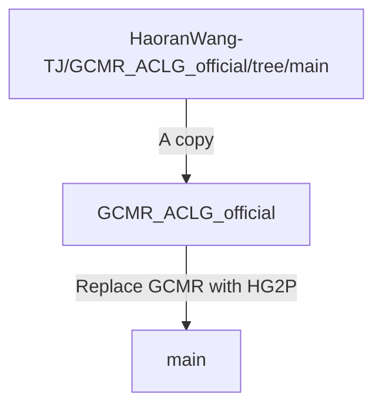

# HG2P: Hippocampus-inspired High-reward Graph and Model-Free Q-Gradient Penalty for Path Planning and Motion Control
This is a PyTorch implementation for our paper: [HG2P: Hippocampus-inspired High-reward Graph and Model-Free Q-Gradient Penalty for Path Planning and Motion Control](https://arxiv.org/abs/2410.09505).

Our code is based on official implementation of [HIGL](https://github.com/junsu-kim97/HIGL) (NeurIPS 2021).

## Branch Tree
We implemented our code based on our another repository [GCMR_ACLG_official](https://github.com/HaoranWang-TJ/GCMR_ACLG_official), which serves as a baseline and comparison.
This repository was implemented as follows:



## Installation
```
conda create -n aclg_gcmr python=3.7
conda activate aclg_gcmr
./install_all.sh
```

Also, to run the MuJoCo experiments, a license is required (see [here](https://www.roboti.us/license.html)).

## Install MuJoCo
### MuJoCo210
1. Download the MuJoCo version 2.1 binaries for
   [Linux](https://mujoco.org/download/mujoco210-linux-x86_64.tar.gz) or
   [OSX](https://mujoco.org/download/mujoco210-macos-x86_64.tar.gz).
2. Extract the downloaded `mujoco210` directory into `~/.mujoco/mujoco210`.
```
mkdir ~/.mujoco
tar -zxvf mujoco210-linux-x86_64.tar.gz -C ~/.mujoco/
```

If you want to specify a nonstandard location for the package,
use the env variable `MUJOCO_PY_MUJOCO_PATH`.
```
vim ~/.bashrc
export LD_LIBRARY_PATH=$LD_LIBRARY_PATH:~/.mujoco/mujoco210/bin
export LD_LIBRARY_PATH=$LD_LIBRARY_PATH:/usr/lib/nvidia
source ~/.bashrc
```

### MuJoCo200
1. Download the MuJoCo version 2.0 binaries for
   [Linux](https://www.roboti.us/download/mujoco200_linux.zip) or
   [OSX](https://www.roboti.us/download/mujoco200_macos.zip).
2. Extract the downloaded `mujoco200` directory into `~/.mujoco/mujoco200`.

```
vim ~/.bashrc
export LD_LIBRARY_PATH=$LD_LIBRARY_PATH:~/.mujoco/mujoco200/bin
export LD_LIBRARY_PATH=$LD_LIBRARY_PATH:/usr/lib/nvidia
source ~/.bashrc
```

***Key license***

Also, to run the MuJoCo experiments using MuJoCo200, a license is required (see [here](https://www.roboti.us/license.html)).
```bash
e.g., cp mjkey.txt ~/.mujoco/mjkey.txt
```

## Usage
### Training & Evaluation
- Ant Maze (U-shape)
```
./scripts/aclg_gcmr_ant_maze_u.sh ${reward_shaping} ${timesteps} ${gpu} ${seed}
./scripts/aclg_gcmr_ant_maze_u.sh sparse 7e5 0 2
./scripts/aclg_gcmr_ant_maze_u.sh dense 7e5 0 2
```

- Ant Push
```
./scripts/aclg_gcmr_ant_push.sh ${reward_shaping} ${timesteps} ${gpu} ${seed}
./scripts/aclg_gcmr_ant_push.sh sparse 7e5 0 2
./scripts/aclg_gcmr_ant_push.sh dense 7e5 0 2
```